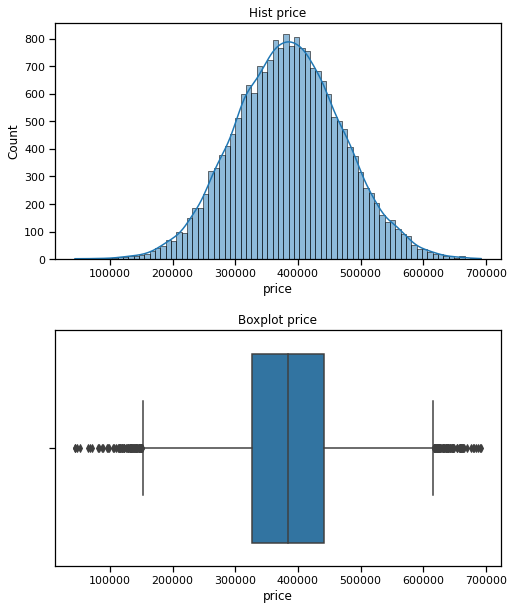

# "Drop first" can hurt your OLS regression model's interpretability
## An experiment to test which OHE columns should be dropped for best OLS linear regression model results

**Author**: Jessica Miles

# Overview

As a student of data science, I recently learned how to model variable interactions using Ordinary Least Squares (OLS) linear regression. It struck me as strange that the common advice to avoid the Dummy Variable Trap when analyzing categorical variables is to simply drop the first column based on the alpha-numeric category labels.

My first intuition was that it must matter to some degree which column we choose to drop. And if it does matter, dropping a column because its label came first seemed very arbitrary and especially scientific.
I found that while there are plenty of web resources describing why we drop a column in this scenario, few attempted to address the question of which to choose. So, to satisfy my curiosity and strengthen my understanding of OLS linear regression, I created some experimental data and tested the results of dropping different columns.

My initial goal was to answer the following questions:
>- Does it matter which column we drop? In other words, will this choice affect the model's results?
>- If it does matter, how should data scientists select the appropriate column to drop?

My hypothesis was that it could matter, and that in some scenarios it would be more appropriate to drop the column that best represents the average of the target. To test this, I generated a dataset including categorical variables that had average values, and used them to generate target values. I then tested different models on the same data, comparing model coefficients and accuracy when dropping no columns, the first (minimum) column, and the column representing the average.

My analysis revealed that **while the column dropped does not appear to affect an OLS linear regression model's predictive accuracy, it can have a significant impact on the interpretability of the model's coefficients**. 

Data scientists preparing an Ordinary Least Squares multiple linear regression model should carefully consider which columns they drop from each category if their goals for analysis include: 
- Ranking standardized coefficients to infer relative magnitude or importance of predictors' impacts on the target variable (i.e. "Does square footage or the number of bedrooms add more to a home's sale price?")
- An accurate understanding of how a unit change of predictor variable impacts the target (i.e. "What is the average increase in home sale price for each square foot of living space added?")
- Explaining either of the above results to non-technical stakeholders.

Arbitrarily dropping the first column without considering what it represents can make it difficult to interpret the model coefficients not only with accuracy, but also in a way that will be intuitive for non-technical stakeholders. 

**Instead of relying on the convention of dropping the first column, data scientists should consider dropping columns that naturally represent logical baseline reference points, from which the model will assume all included predictor variables to deviate.** In some cases a minimum value may be appropriate, in other cases an average value may be appropriate, and in still others the appropriate reference category may depend entirely on the goal of the analysis. 

# Arbitrarily dropping "first"
Python libraries such as Pandas and sckikit-learn have parameters built in to their one-hot-encoding methods which allow us to drop a column from each categorical group. A common approach is to drop first, meaning whichever column represents the category value name that comes first alpha-numerically in the set. 

In fact, dropping first seems to be such a common convention that both Pandas and scikit-learn have handy constants you can use to do this so you don't have to figure out the first category. 

But is it really the best way to choose a variable to drop in all situations? In the following sections, I'll walk through how I created data to test this, and concluded that dropping the first column is not always the best option. For the detailed steps and code, see [my jupyter notebook](./ohe_testing.ipynb).

---

# Creating the test data set
I created a test data set of n=20,000 based on home characteristics and sales, where my OLS linear regression model would be trying to predict a home's eventual sale price.
First, I generated the independent (predictor) variables:

- Square Feet of Living Space: A randomly generated continuous variable following a normal distribution, with a mean of ~2,800.

- Zip Code: A categorical variable with a large number of categories (70). I created multipliers to control how much each zip code affected Price using random numbers from a normal distribution, and randomly assigned them to fairly even groups of houses. The 'first' Zip Code category of 30000 was set up to detract most from average Price so that it represented either the minimum contribution, or the maximum detraction, depending on your perspective. The average Zip Code category contributed little to Price, and the highest added the most.

- Condition: A categorical variable with a small number of variables (5). Included the following ranked values: Poor, Below Average, Average, Above Average, and Excellent. I engineered the multipliers so that Average Condition added nothing to Price; Poor and Below Average detracted; and Above Average and Excellent added. 70% of houses were assigned to the Average condition category, 10% of houses were each assigned to Below and Above average, and 5% of houses were each assigned to Poor and Excellent.

- Day of the Week (DOTW): A capricious variable that contributes to the price without any particular pattern (I just made up the coefficients for each day). I tested excluding this from my model to reduce the variability in the target that the model should be able to explain, to make it somewhat more realistic.

With my Sq Ft values randomly generated, and houses assigned to categories as described above, I applied the multipliers to generate Price. I used a starting baseline of $100,000 (which is the expected y-intercept), and applied categorical multipliers to a constant of $50,000. 

I now had a target variable, Price, which had been generated based on known coefficients of each predictor variable.

I noted the expected coefficients for each predictor category in original units, as well as the coefficient in standardized units (standard deviations) for the continuous variable, Square Feet. This allowed me to compare the results from each model against expected coefficients.

# Modeling
My primary question was whether the category column dropped from the model (i.e. used as the model's reference point) affected the results. I wanted to test dropping the first column, since it's the common convention, and as the alternative I wanted to drop a column representing the average category: the category in which mean home Price most closely matched the population mean.
And there were three different types of results I was interested in:
1. Predictive accuracy
2. Interpretability - Accurate ranking of standardized coefficients
3. Interpretability - Accurate AND intuitive original unit coefficients

So I needed at minimum:
- Two different models to compare dropping the first column versus the average
- Another two models to compare standardized coefficients versus coefficients in original units

I decided to also run models where no categorical columns were dropped just to see what happened. And finally, I varied whether I included the DOTW variable in the model or not, where including it should allow the model to predict 100% of the target's variability, and excluding it should be slightly more realistic.

Ultimately I ended up iterating through 12 models with these different parameters, and then reviewed the results. 

# Model Interpretation and Conclusions
To compare accuracy, I used a train-test split and generated the R-squared, Residual Sum of Squares (RSS), and Root Mean Squared Error (RMSE) for both train and test.

To compare interpretability, I compared the test model coefficients to expected, and reviewed test models differed from watch other.

## Predictive Accuracy
Being able to accurately predict the target given the independent variables is one of the key measures of success for a linear regression model.

In the first 6 models, I included the 'day of the week' variable, and in the last 6 I left it out, so it would act as a confounding variable.

Although other aspects of how the data was processed were varied, such as whether the data was standardized and which category was dropped, these factors do not have an appreciable affect on R-Squared, Root Mean Squared Errors, or Residual Sum of Squares (not shown above for brevity). 

The models which were run without the 'day of the week' variable were not perfect, which makes intuitive sense. But there doesn't appear to be any difference between these models where I excluded DOTW; they have the same R-squared and RMSE.

I conclude that varying which  category column is dropped from the model does NOT affect either the amount of variability that the model explains, or the accuracy of the model's predictions.

## Interpretability - Accurately Ranking Standardized Coefficients
Another way we might want to be able to use our model is to rank the standardized coefficients to compare the magnitude of their effects on the target, or their importance. The goal would be to determine which variables increase or decrease the target to a greater degree. 

It's important to standardize continuous variables so their coefficients can be directly compared in this way. The one-hot-encoded categorical variables are left as 0 and 1.

These insights, combined with domain knowledge, could be instrumental for business stakeholders to decide on an appropriate action plan if their goal is to affect the target.

To measure how accurate the rankings of our models would be, consider the set of heatmaps below. Although each model's heatmap uses its own scale for the color gradient (so we shouldn't try to compare the color shades directly), we would expect the general gradient order of the test models to match the expected order.

In the Dropped First model, the Zip Codes and y-intercept follow the color order pretty well. But the Condition categories and Square Feet are way too low in the ranking; their colors do not blend into the gradient as they should.

In the Dropped Average model, the y-intercept is much higher than expected; it obviously sticks out of the color gradient. But the Zip Codes, Condition, and Square Feet look in pretty much the expected order.

The Dropped Average model more accurately ranks the coefficients we would care about (Square Feet, Condition, and Zip Code), as opposed to the Dropped First model which ranks the y-intercept fairly accurately, but is quite far off on Condition.

Let's remove the Zip Code categories to zoom in on the others.

If we take them out of the context of Zip Codes, it does look like the order of Condition categories matches expected for both models. In other words, Excellent Condition adds more than Above Average, which are above Average, etc.

However, Square Feet should add about $55k more to Price than Excellent Condition. We see that this difference is pretty accurate in the Dropped Average model, but in the Dropped First model, Excellent Condition is ranked above Square Feet.

If I were to use the standardized Dropped Average model to estimate which variables were more important to increasing price, I'd be pretty accurate.

But if I were to use the standardized Dropped First model to estimate this, I'd assume that Zip Codes were by and large the most important, followed by Condition Excellent, and then Square Feet. This would not be very accurate.

## Accurately AND Intuitively Interpreting Original Unit Coefficients
We also might be interested in using the coefficients in original units, from the model where we did not standardize the data, to understand how the target variable changes per unit of each predictor variable. 
For instance, we would want to be able to use the coefficient associated with Square Feet to say "For each sq ft, the price goes up by an estimated $100."

I've created similar heatmaps to review original unit coefficient accuracy. Note that in this visualization, the color scale of both test models was forced to match the expected model, so we can compare the values by comparing the shades. Here, we care about how accurate the coefficients are, as opposed to with standardized coefficients, where we cared mode about the ranking order.

We can see that the Dropped Average model's coefficients are very close to expected coefficient values. Its colors are very close to expected, and in the right order.
However, in the Dropped First model, the y-intercept was very low, which caused most of the other coefficients to be too high to make up for it.

We can see that Square Feet is pretty close, but Zip Code values are quite high. Let's remove Zip Codes to zoom in on the other variables.

Let's take some time to interpret the differences we see here, as the fact that the Dropped First model's unit coefficients do not exactly match expected do not necessarily mean they are inherently wrong or not useful.

First, let's notice that both test models have very accurate unit coefficients for Square Feet, our only continuous variable.

Second, we can see clearly that the Dropped Average model has unit coefficients for Condition variables that very closely match expected, while the Dropped First model coefficients do not. Practically, what does this mean?

It's important to put these unit coefficients in the context of each model's baseline, or reference point. The coefficients must be interpreted with respect to this baseline.

For our continuous variable, Square Feet, the reference point was 0, and this would be the case for any continuous variables we included.

But for our categorical variables, the reference point for the baseline became whichever category column we dropped from the model. So we can say that:

>The differences in unit coefficients between the two test models is due to the models having different reference points for their categorical values.

Now it makes more sense why the coefficient for Square Feet is the same for both models, but the categorical coefficients differ: Square Feet assumed a baseline of 0 in both models.

The next logical question to ask is: Is one baseline inherently better than the other? To answer this question, let's consider how we would interpret the Condition unit coefficients for the Dropped First model, assuming we didn't know what was expected.

In the Dropped First model, we dropped the Poor Condition column. So our baseline assumes a reference point of having the worst possible condition. We would interpret the coefficients like:

- Having a Condition of Below Average adds $50k to a house's baseline price
- Having a Condition of Average adds $66k to a house's baseline price
- Having a Condition of Above Average adds $71k to a house's baseline price
- Having a Condition of Excellent adds $81k to a house's baseline price

We're interpreting each Condition level as adding to the baseline, even Below Average. Whereas with the Dropped Average model, the baseline assumes a condition of Average, so we would interpret the coefficients like:
- Having a Condition of Poor subtracts $66k from a house's baseline price
- Having a Condition of Below Average subtracts $16k from a house's baseline price
- Having a Condition of Above Average adds $5k to a house's baseline price
- Having a Condition of Excellent adds $15k to a house's baseline price

The steps between the coefficient values are the same in both models, but the positive/negative aspect is different.

One is not objectively better than the other, but:

>If the goal of analysis is to provide actual coefficient values to non-technical stakeholders, dropping the average category for Condition yields the most intuitive coefficients that are more likely to make sense to stakeholders.

Imagine the difficulty of explaining that although we have a positive number for the impact of Below Average Condition, this is within the context of a baseline house that actually has a negative price… it really doesn't make much sense.

# Summary
Although the category you choose to drop won't affect the model's prediction accuracy, it can have a significant impact on the interpretability of the model.

If you plan to use the coefficients in your model to make accurate inferences about:
- impact on the target per predictor unit,
- or the magnitude of impact each predictor has in relation to others,

then you should carefully consider which categorical values you drop from your model.

A linear regression model's coefficients are interpreted in the context of a baseline model. For continuous variables, the baseline uses a reference point of 0. But for categorical variables, whichever column is dropped becomes the reference point, which has a significant impact on how coefficients can be interpreted.

It's important for data scientists to consider which columns represent the most intuitive reference points for each category, and drop those. Simply dropping the first column is arbitrary: the first column will not necessarily represent the minimum, and also the minimum does not necessarily always make a good reference point.

A thoughtful choice of which column to drop will yield coefficients that are much easier to interpret accurately.

# How should you choose which column to drop?
Instead of assuming that the first or minimum category value is the most appropriate, consider which category represents the most intuitive reference point for your stakeholders, or to help answer the questions at the root of your analysis.

For example, if you were modeling predictors of salary you might have a categorical predictor for level of schooling with the following values:
- Less than High School
- High School or GED
- Associate's degree
- Bachelor's degree
- Master's degree
- Doctorate degree

If you relied on the alpha-numeric first column, then Associate's degree would be your reference point. This could make sense if your stakeholders would be interested in how much people with less than an Associate's degree earn compared to people with higher than an Associate's degree.
But it could also be reasonable to use High School or GED as the reference point, if you felt that was a more accurate representation of the population's average education attainment. You could even figure out which of these categories seems to have a mean or median salary that most closely matches the mean or median of the population, to have a statistical reason to choose a particular category as the reference point.
And of course, if your primary goal is prediction, you don't have to worry about which category value you drop!

---

I hope others find this useful and informative. As I'm still a student of data science, I'd welcome any thoughts on my testing approach or applicability of my conclusions

